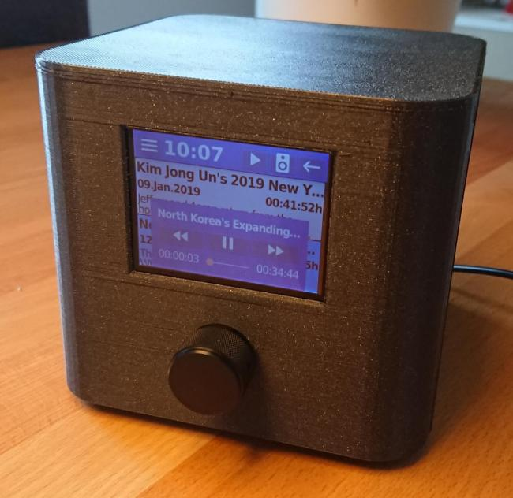

Buildroot External structure for DigitalRoosterGui
===================

Buildroot external for creating a root file system running [DigitalRoosterGui](https://github.com/truschival/DigitalRoosterGui)
as digital alarm clock.

The following extension boards for Raspberry Pi or BananaPi are configured:

* Adafruit [PiTFT2.8" capacitive touch](https://learn.adafruit.com/downloads/pdf/adafruit-2-8-pitft-capacitive-touch.pdf)
* Adafruit [Speaker Bonnet with MAX98357 I2S amp](https://cdn-learn.adafruit.com/downloads/pdf/adafruit-speaker-bonnet-for-raspberry-pi.pdf)
* Grayhill rotary encoder [61C11-01-08-02](http://lgrws01.grayhill.com/web1/images/ProductImages/I-21-22.pdf)

----
# License

Copyright 2018 by Thomas Ruschival <thomas@ruschival.de> 

Licenced under the GNU PUBLIC LICENSE Version 2. The license terms can be found
in the file LICENSE

-----
# Build Pre-requisites

- [buildroot](https://buildroot.org/) installation (`git clone git://git.buildroot.net/buildroot` )

## Setup

	mkdir <build_tree>
	make BR2_EXTERNAL=<local_clone_of_this_repo> -C<buildroot_installation_dir> O=<build_tree> XXX_defconfig 
	cd <build_tree>
	make menuconfig (optional)

### Target build configurations

Currently the following configurations (`XXX_defconfig`) for DigitalRooster exist:

* `rpi0w_defconfig` DigitalRooster on a Raspberry Pi Zero W ( __tested__ )
* `bananapi_m2_zero_defconfig` DigitalRooster on a BananaPi M2 Zero ( __in development __)

## Environment variables

### Network configuration

``boards/common/post_build.sh`` has a hook to configure wifi network passwords.

Set the environment variable ``LOCAL_WIFI_NET_CFG`` to a file path containing your wifi network configuration.
The content of this file will be added to ``/etc/wpa_supplicant.conf`` of your target filesystem.

#### Example:
	
	$ cd <build_tree>
	$ cat ~/my_wifi_conf
	network={
        ssid="my_wifi_network_ssid"
        psk=081937e670bxxxxxxxxxxxxxxxf63994c45ce2a43d
	}
	$ export LOCAL_WIFI_NET_CFG=~/my_wifi_conf
	$ make
	

